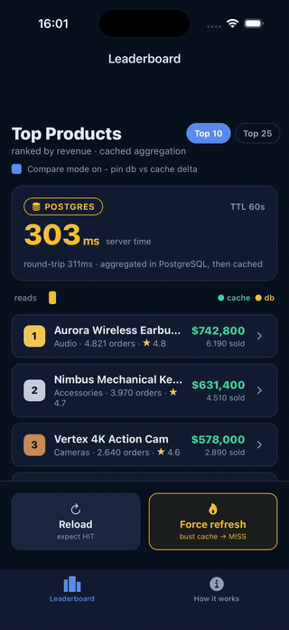
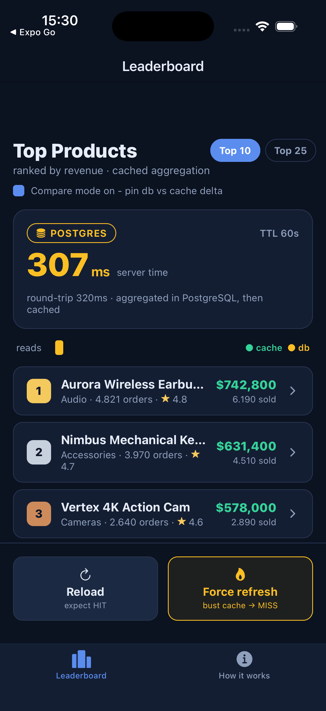
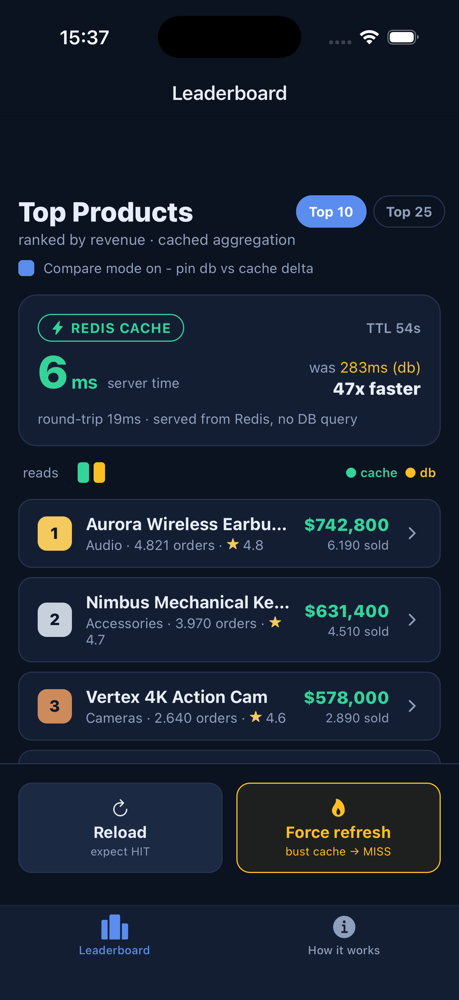
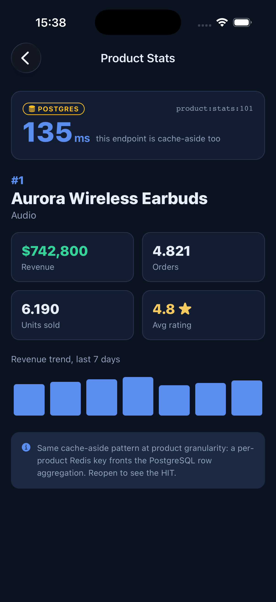
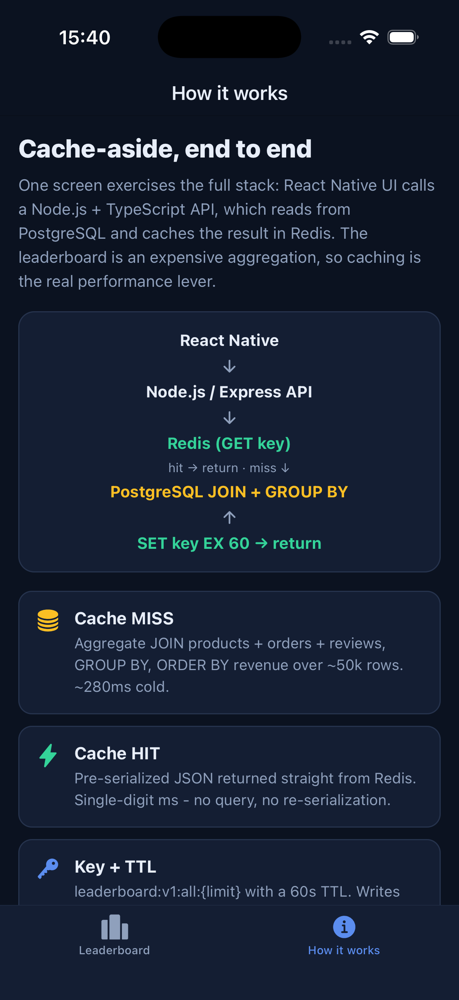
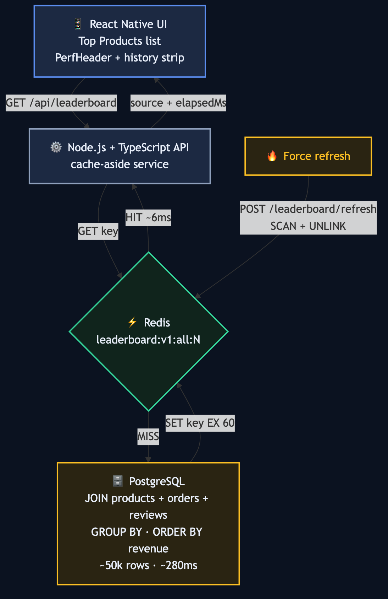

# Leaderboard Cache - React Native + Node.js + PostgreSQL + Redis

A full-stack demo of the classic **cache-aside** performance pattern. One mobile
screen exercises the whole stack: a React Native UI calls a Node.js + TypeScript
API, which serves a ranked "Top Products by revenue" leaderboard built from an
expensive PostgreSQL aggregation, fronted by a Redis cache.

The point is to make the caching win **visible and deterministic**: every read
shows a live latency badge and a `REDIS CACHE` / `POSTGRES` tag, and a single
**Force refresh** button busts the cache so you can trigger a guaranteed MISS
(slow, ~280ms) then reload to see a HIT (single-digit ms) in one tap.

Built with Expo, React Native, TypeScript, and Zustand. The mobile app runs on
built-in mock data so it demos standalone on a simulator; point it at the Node
backend in [`backend/`](backend) to hit live PostgreSQL + Redis.

## Demo

MISS (Postgres) - HIT (Redis, 51x faster) - Force refresh busts the cache back to
a MISS - HIT again - product detail.



## Screenshots

| Cache MISS (Postgres) | Cache HIT (Redis) | Product detail | How it works |
| --- | --- | --- | --- |
|  |  |  |  |

## How it works



A read checks Redis first (`GET key`). On a HIT it returns the pre-serialized
JSON in single-digit ms. On a MISS it runs the expensive PostgreSQL aggregation
(`JOIN + GROUP BY + ORDER BY` over ~50k orders, ~280ms), caches the result with
`SET key EX 60`, then returns. Force refresh `SCAN + UNLINK`s the key so the next
read is a guaranteed MISS.

## Features

- **Cache-aside aggregation**: expensive `JOIN products + orders + reviews`,
  `GROUP BY`, `ORDER BY revenue` cached in Redis with a 60s TTL
- **Live latency badge**: server time + round-trip, color-coded by speed
- **Source tag**: every read labels itself `REDIS CACHE` (green) or `POSTGRES` (amber)
- **Force refresh**: busts the cache for a deterministic MISS - HIT before/after
- **Compare mode**: pins the previous read's latency to show the `Nx faster` delta
- **History strip**: the last ~12 reads as a HIT/MISS sequence
- **Product detail**: the same cache-aside pattern at a second granularity
- **Resilient**: backend degrades to `source:db` if Redis is unavailable

## Tech Stack

- **Mobile**: Expo SDK 52, Expo Router, TypeScript, Zustand
- **Backend**: Node.js, TypeScript, Express, `pg`, `ioredis`
- **Data**: PostgreSQL (source of truth), Redis (cache), Docker Compose for both

## Getting Started

### Mobile (standalone, mock data)

```bash
npm install
npx expo run:ios   # or: npx expo run:android
```

### Full stack (live PostgreSQL + Redis)

```bash
cd backend
docker compose up -d
cp .env.example .env && npm install && npm run seed && npm run dev
```

Then set `EXPO_PUBLIC_API_URL=http://localhost:4000` in the app root `.env` and
restart Metro. See [`backend/README.md`](backend/README.md) for endpoints and the
caching strategy.

## Project Structure

```
app/                      # Expo Router screens
  (tabs)/index.tsx        # Leaderboard (PerfHeader, list, ActionBar)
  (tabs)/about.tsx        # How it works
  product/[id].tsx        # Product stats - cache-aside at product granularity
src/
  features/leaderboard/   # components, hooks, services, types
  store/                  # Zustand: perfStore (history), uiStore (limit, compare)
  data/products.ts        # mockup dataset (mirrors the API shape)
backend/                  # Node + TS + Express + PostgreSQL + Redis
  src/leaderboard/        # controller -> service (cache-aside) -> repository (SQL)
  src/db/                 # pool, schema.sql, seed.ts (~50k orders)
  src/cache/redis.ts      # ioredis + SCAN/UNLINK invalidation
```
